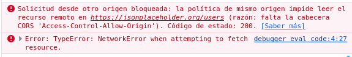
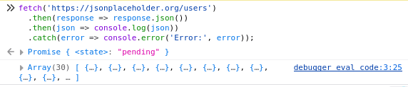

# UD01UT01 Arquitecturas y Lenguajes de Programación en Clientes Web

__Autor:__ Pedro Martín Escuela

## Actividad 1

1. __¿En qué se diferencian esencialmente ambos modelos en términos de dónde se ejecuta el código y quién tiene acceso a los resultados?__

    Las dierencias entre la ejecución en entorno __servidor__ y __cliente__, comienzan en que, el codigo que se ejecuta en entorno del __cliente__, ocurre en el __navegador__ del usuario que interactúa con él, mientras que el código en el lado del __servidor__ se ejecuta en un __servidor remoto__ para gestionar datos, lógica de negocio y la generación de contenido antes de __enviarlo al cliente__. Por esto mismo, el codigo ejecutado en entorno del __cliente__, __puede ser accedido por el usuario__, mientras que el que se ejecuta en entorno de __servidor__, es procesado por este, así que __no es accesible__.

2. __Desde la consola del navegador (F12 → Console), ejecuta el siguiente código JavaScript: console.log('Hola desde el cliente'). Luego, intenta imaginar y explicar por qué no sería posible ejecutar un código PHP directamente en esa misma consola__

    No sería posible por que el codigo de __php se ejecuta en entorno de servidor__ y no es accesible por el usuario, al contrario que el de __JavaScript__, que como acabamos de comprobar, __se ejecuta en el cliente__.

3. __Reflexión: Basándote en lo anterior, enumera al menos una ventaja y una desventaja clave de la programación en el cliente (JavaScript) frente a la programación tradicional en el servidor.__

    Una __desventaja__ de la ejecución en servidor respecto al cliente, es su __alto coste de mantenimiento__ y la __dependencia__ de todos los usuarios de este. Aun que por otro lado, una ventaja que tiene, es la __centralización de datos__, lo que implica __más seguridad__ y __evita la inconsistencia de datos__.

## Actividad 2

La actividad es realizada en el directorio:

```
/ut1/tareas/tarea1/actividad2
```

`index.html` con el codigo de HTML

```html
<!DOCTYPE html>
<html lang="en">
<head>
  <meta charset="UTF-8">
  <meta name="viewport" content="width=device-width, initial-scale=1.0">
  <link rel="stylesheet" href="styles.css">
  <title>Actividad 2</title>
</head>

<body>
  <div class="contenedorPrincipal">

    <!--Actividad 2.1 -->
    <div class="apartado">
      <div class="boton">
        <button type="button" onclick="alert('Script inline ejecutado')">Actividad 2.1 (Alert)</button>
      </div>
    </div>

    <br>

    <!-- Actividad 2.2 -->
    <div class="apartado">
      <div class="boton">
        <button type="button" class="boton2" onclick="saludar()">Actividad 2.2 (Saludar)</button>
      </div>
      <div class="parrafo">
        <p id="saludo" style="display: none;">¡Hola desde un script interno!</p>
      </div>
    </div>

    <br>

    <!-- Actividad 2.3 -->
    <div class="apartado">
      <div class="boton">
        <button type="button" class="boton2" onclick="changeBackground()">Actividad 2.3 (Cambiar color)</button>
      </div>
    </div>
  </div>
  <script src="./script.js"></script>
</body>

<script>
  // Actividad 2.2
  function saludar(){
    document.querySelector('#saludo').style.display = 'block';
  }

</script>

</html>
```

`index.js` con el script del apartado 3 de la actividad

```js
// Actividad 2.3
function changeBackground(){

  document.querySelector('body').style.backgroundColor = 'red';
  // lightcyan no se distingue
}
```

## Actividad 3

1. __Copia y pega el siguiente código HTML y JavaScript en un nuevo archivo. Contiene un error intencionado.__

2. __Abre el archivo en tu navegador y observa el comportamiento incorrecto.__

3. __Usa las Herramientas de Desarrollo (F12) para encontrar y solucionar el error. Sigue el flujo:__

    __a) Revisa la pestaña "Consola" para ver si hay errores.__

    __b) Si no hay errores evidentes, usa la pestaña "Sources"/"Debugger" para establecer un punto de ruptura (breakpoint) en la función validarFormulario() y ejecuta el código paso a paso, observando los valores de las variables.__

    La condición del if/else es que si el caracter del arroba está en una posición mayor que 0, este se ejecuta correctamente, y si no, da un error. Como tal, no es un fallo, ya que estaría mal si fuera > -1 por que podríamos poner un correo cuyo primer caracter fuese @ y dejaría enviarlo. Otro error podría ser que no detecta si el correo tiene extensión (.org, .com, etc), o que al enviarse el formulario correctamente, se refresca la página, cosa que impide ver el mensaje de que se ha enviado correctamente.

## Actividad 4

Los navegadores web ejecutan código JavaScript en un entorno seguro y "enjaulado" conocido como sandbox. Este mecanismo es fundamental para las capacidades y limitaciones de ejecución. Investiga y realiza lo siguiente:

__1. Experimento Práctico - La Política del Mismo Origen (Same-Origin Policy):__

    a) Abre las herramientas de desarrollo de tu navegador (F12) y ve a la pestaña "Consola".

    b) Visita un sitio web popular como https://www.wikipedia.org.

    c) Intenta ejecutar el siguiente código en la consola para intentar leer información de otro origen (dominio):

    fetch('https://jsonplaceholder.org/users')
    .then(response => response.json())
    .then(json => console.log(json))
    .catch(error => console.error('Error:', error));

    d) Observa y analiza: ¿Qué sucede? Si obtienes un error, cópialo y explícalo brevemente. ¿Qué mecanismo de seguridad del navegador está impidiendo o permitiendo esta acción?

    e) Contrasta: Ahora visita la página de prueba de JSONPlaceholder https://jsonplaceholder.org y ejecuta el mismo código en su consola. ¿Ocurre lo mismo? ¿Por qué?

El error que aparece es de CORSS, que es un bloqueo de seguridad que implementa el navegador cuando una página web intenta acceder a recursos de un dominio diferente al de su origen.

<div align=center>
    
</div>

Cuando ejecutamos el codigo en la otra página, esta no da error ya que estos recursos si pertenecen al mismo dominio de su origen. En lugar del error, nos devuelve un array de usuarios pedidos.

<div align=center>
    
</div>